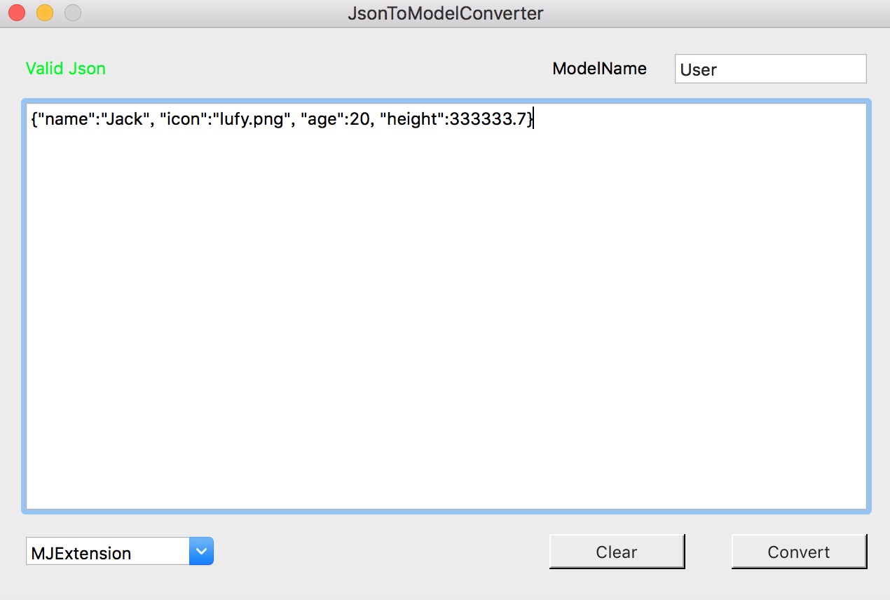
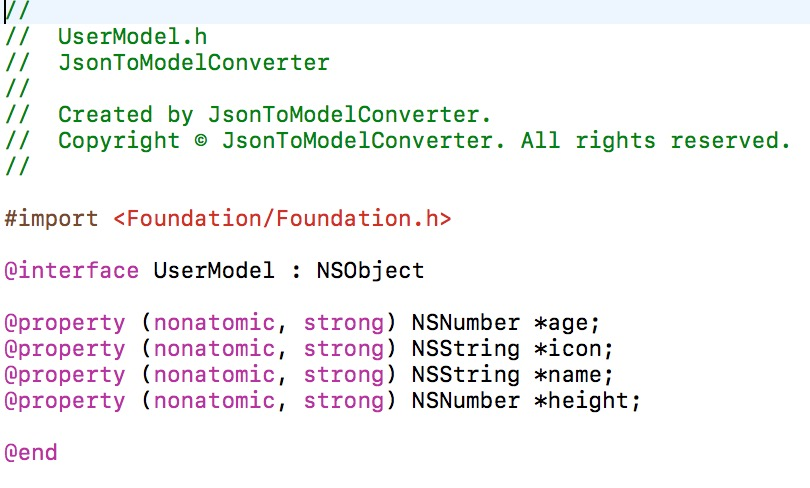
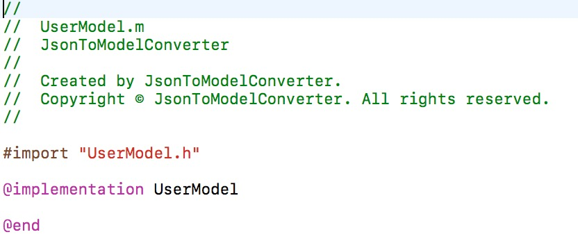

# JsonToModelConverter
# 简介
一款辅助iOS开发的Mac小工具，可以把json数据快速转换生成对应的model类。目前只支持MJExtension所需model的生成。

# 使用
* 打开JsonToModelConverterApp目录双击App使用或者复制到应用程序文件夹
* 运行该工程生成JsonToModelConverter.App复制到应用程序文件夹

# 效果图

# TODO
* 增加更多model的支持
* 更多的测试

# License
JsonToModelConverter is available under the MIT license.
